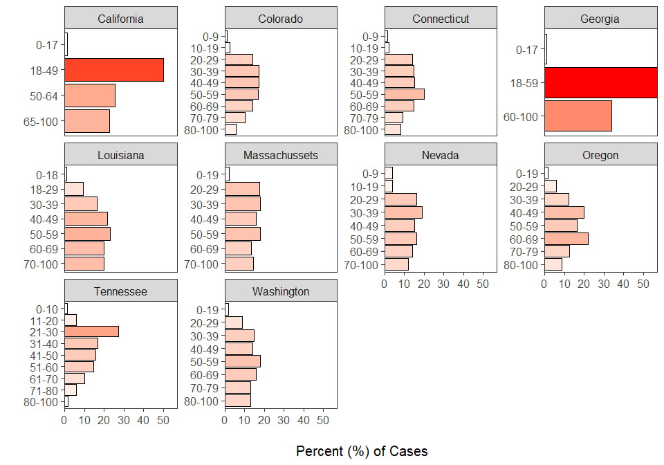
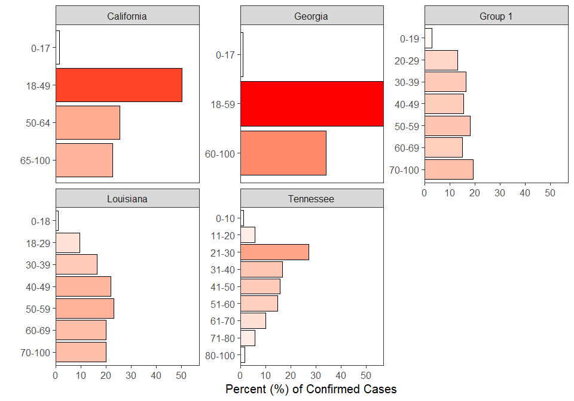
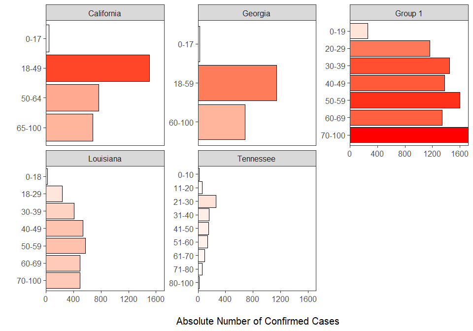
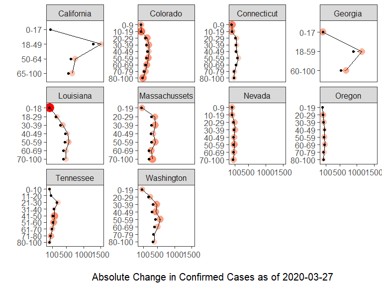

# Introduction

The rapidity of the spread of the novel coronavirus, COVID-19, is one of the most notable features of this disease.  Much scientific and journalistic investigation into epidimeological aspects of the coronavirus have focused on *case fatality rates* (CFRs) and other demographic variables that may contribute to increased morbidity.  For instance, it has been argued based on data deriving from China and more recently the CDC, that CFRs for those under 40 are relatively low. 

In contrast, less attention has been given to the *case detection rate* (CDR) by age, except in cases where the asymptomatic nature of transmission has been noted, especially in younger age groups. This analysis aggregates available data from US states to identify which age groups are potentially leaders in CDRs, and the extent to which this is variable by state or a broader consequence of the disease.  All analyses are for visualization purposes -- no inferential statistics have been employed due to the inherent biases emanating from under-testing of the US population.

First, thanks are given to the site www.covidtracking.com, which has provided the links to various state pages with demographic data.  Second, this is an ongoing "document" that is updated every day.  The paragraph below describes the represented date range of data and states represented.  Unfortunately, due to the vagaries of state reporting, most states do not provide sufficient data to conduct these analyses.  For comments, concerns, or access to higher resolution data, please contact me at alanfarahani@gmail.com.

The assembled data extend from \infty{} to 2020-03-27, and comprise 10 unique states (the states represented are California, Colorado, Connecticut, Georgia, Louisiana, Massachussets, Nevada, Oregon, Tennessee, Washington) for a total of 17357 confirmed cases.

# Methods and Materials

Data are acquired from state sources where age-demographic material is published (e.g. https://www.cdph.ca.gov/Programs/CID/DCDC/Pages/Immunization/ncov2019.aspx).  In most cases, states provide either the raw case count or a proportion of cases followed by an absolute number of confirmed cases.

Screenshots of all of the state pages are taken, and the data are hand-recorded into an excel spreadsheet that contains untransformed data.  In one case (the state of Connecticut), absolute numeric data apart from the total number of confirmed cases are not provided.  Nevertheless a graph is -- therefore counts for each age range were estimated visually and the sum of these counts was made to match the published confirmed cases.  Therefore it is possible there is some error (~ +/-10) associated with the estimates for this state.


```r
knitr::include_graphics("./0326/Screenshot_2020-03-26 Power BI Report.png")
```

<div class="figure">

<p class="caption">(\#fig:unnamed-chunk-1)Representative example of data supplied by the state of Nevada regarding distribution of confirmed cases across age ranges.  Accessed on 26-03-2020.</p>
</div>

# Major Trends

Without transformation of the age-ranges, the percent of confirmed cases by ages as of 2020-03-27 can be seen in Figure \@ref(fig:state-dist). 


```r
#generate a common theme
covid_bar_theme <- list(
    theme_bw(base_size = 15),
    theme(panel.grid = element_blank(), legend.position = "none"),
    scale_fill_continuous(low = "white", high = "red"),
    scale_color_continuous(low = "white", high = "red"),
    scale_y_continuous(expand = c(0,0))
)

recent_covid_data %>%
    mutate(age_range = paste(lower_age, upper_age, sep = "-")) %>%
    ggplot(aes(fct_rev(age_range), prop)) +
    geom_bar(stat = "identity", aes(fill = prop), colour = "black") +
    facet_wrap(~state, scales = "free_y") + coord_flip() +
    xlab("") +
    ylab("\n Percent (%) of Cases") +
    covid_bar_theme
```

<div class="figure">

<p class="caption">(\#fig:state-dist)Percent of confirmed COVID-19 cases by age-range given by state authorities.</p>
</div>

Grouping of states by commonly used age-ranges reveals additional insights into the age-structure of those confirmed with the novel coronavirus (Figure \@ref(fig:new-state-dist)). It can be observed that contrary to widespread assumptions, positive carriers of the novel coronavirus (at least those who were symptomatic or suspicious enough of their condition to seek testing), can range uniformly across age groups.  Inter-state differences must be accounted for either by a) patterns of community spread of the virus specific to the social dynamics of those states and/or b) patterns of testing based on the ability of state officials (and representatives) to respond.


```r
# generate new ranges
gen_age_label <- function(state_name){
  recent_covid_data %>% filter(state == state_name) %>%
  mutate(age_range = paste(lower_age, upper_age, sep = "-")) %>% pull(age_range)
}

mass_label <- mass_label <- gen_age_label("Massachussets")


state_grp1 <- c("Colorado", "Connecticut", "Washington", "Massachussets", "Nevada", "Oregon")
#state_grp2 <- c("California", "Georgia")

graph_grp1 <- recent_covid_data %>%
    filter(state %in% state_grp1) %>%
    mutate(age_range = cut(lower_age, breaks = c(-1,seq(from = 19, to = 69, by = 10), 100), labels = mass_label)) %>%
    group_by(age_range) %>%
    summarise(cases = sum(cases), totals = sum(unique(total)), state = "Group 1")

# graph_grp2 <- recent_covid_data %>%
#     filter(state %in% state_grp2) %>%
#     mutate(age_range = cut(lower_age, breaks = c(-1, 17, 49, 64, 100), labels = cal_label)) %>%
#     group_by(age_range) %>%
#     summarise(cases = sum(cases), totals = sum(unique(total)), state = "Group 2")
  
graph_else <- recent_covid_data %>%
  filter(!(state %in% c(state_grp1))) %>%
  mutate(age_range = paste(lower_age, upper_age, sep = "-")) %>%
    group_by(state, age_range) %>%
    summarise(cases = sum(cases), totals = sum(unique(total)))

all_new_state_graphs <- bind_rows(graph_grp1, graph_else)

rm(graph_grp1, graph_else, mass_label)
```


The groups represented in Figure \@ref(fig:new-state-dist) are the following:

1. Colorado, Connecticut, Massachussets, Nevada, Oregon, Washington
 

```r
all_new_state_graphs %>%
  mutate( prop = (cases / totals) *100) %>%
   ggplot(aes(fct_rev(age_range), prop)) +
  geom_bar(stat = "identity", aes(fill = prop), colour = "black") +
  facet_wrap(~state, scales = "free_y") + coord_flip() +
  xlab("") +
  ylab("Percent (%) of Confirmed Cases") +
  covid_bar_theme
```

<div class="figure">

<p class="caption">(\#fig:new-state-dist)Percent of confirmed COVID-19 cases by age-range across states, where it is possible to group states by age-range.</p>
</div>


The following illustrates the new cases by age according to absolute case count (Figure \@ref(fig:new-state-dist-case)).


```r
all_new_state_graphs %>%
   ggplot(aes(fct_rev(age_range), cases)) +
  geom_bar(stat = "identity", aes(fill = cases), colour = "black") +
  facet_wrap(~state, scales = "free_y") + coord_flip() +
  xlab("") +
  ylab("\n Absolute Number of Confirmed Cases") +
  covid_bar_theme
```

<div class="figure">

<p class="caption">(\#fig:new-state-dist-case)Absolute number of confirmed COVID-19 cases by age-range across states, where it is possible to group states by age-range.</p>
</div>

The absolute change in the age-demographic profile of recent confirmed COVID-19 cases can be seen in the figure below (Figure \@ref(fig:covid-case-change)).  It is important to note that some states are actively in the process of changing their age-reporting ranges, and so many states (such as Georgia) may not have cumulative case data that concords with previously published data.


```r
covid_case_change <- previous_covid_data %>%
    inner_join(recent_covid_data %>%
                 select(state, lower_age, upper_age, cases) %>%
                 rename(new_cases = cases)) %>%
    mutate(prop_change = new_cases/cases)

covid_case_change %>%
    mutate(age_range = paste(lower_age, upper_age, sep = "-")) %>%
    ggplot(aes(fct_rev(age_range), new_cases)) +
    geom_point(aes(size = prop_change, colour = prop_change)) +
    geom_point(aes(y = cases))+
    geom_line(aes(group = 1))+
    geom_segment(aes(x = age_range, xend =age_range, y = cases, yend = new_cases ), linetype = "dashed")+
facet_wrap(~state, scales = "free_y") +
    coord_flip() +
    xlab("") +
    ylab(paste("\n Absolute Change in Confirmed Cases as of ", max(recent_covid_data$date), sep = "")) + covid_bar_theme +
  scale_y_continuous(breaks = c(100, 500, 1000, 1500))
```

<div class="figure">

<p class="caption">(\#fig:covid-case-change)Absolute change in confirmed coronavirus cases where the black points represent all previously aggregated data.  The colors and size of the rightmost points indicate the intensity of the proportional change.</p>
</div>

# Recommendations
In order to effectively combat the spread of the novel coronavirus, data on community transmission is needed.  In particular, understanding how and why the virus spreads among certain age demographics rather than others can help official planners respond in advance to possible transmission scenarios.  Furthermore, these data are also essential in messaging to all populations, especially those with maximal visibility in flouting physical distancing recommendations, that transmission of the virus is more demographically widespread than perhaps assumed.
